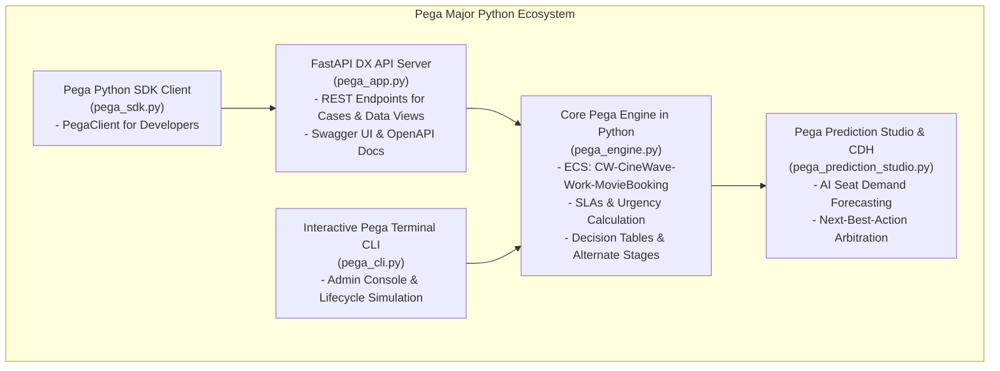

# CineWave Entertainment – Pega Platform™ Python Integration Guide
## Enterprise Pega Major Architecture with Python ('24.1 Infinity & Prediction Studio)

In enterprise Pega architectures, **Python plays a major, mission-critical role**, particularly in:
1. **Pega Prediction Studio**: Training, scoring, and hosting Machine Learning predictive models.
2. **Pega Customer Decision Hub (CDH)**: Next-Best-Action (NBA) arbitration and propensity scoring.
3. **Pega DX API v2 Microservices**: High-performance backend integration for headless Pega case management.
4. **Automation & DevOps SDKs**: Programmatic case lifecycle orchestration via Python.

---

## 1. Architectural Topology



---

## 2. Python Components Overview

### 2.1 `pega_prediction_studio.py` (Pega AI & Machine Learning)
Simulates **Pega Prediction Studio** and **Customer Decision Hub (CDH)**:
- **`predict_seat_demand()`**: Implements adaptive demand elasticity based on show timing, weekend indicators, theatre geographic location, and movie rating. Recommends dynamic AI surge (+₹20) or saver discounts (-₹20).
- **`get_next_best_action()`**: Implements Pega CDH Next-Best-Action strategy calculating arbitration scores:
  $$\text{Arbitration Score} = (\text{Propensity} \times \text{Business Weight}) + \text{Value Score}$$
  Returns personalized retention vouchers (e.g., *Gourmet Popcorn & VIP Lounge Access* for Gold tier, *50% Off Beverages* for VIP tier).

### 2.2 `pega_engine.py` (Core Pega Case Engine)
Implements all Pega Major architectural standards in pure Python:
- **Enterprise Class Structure (ECS):** Base class inheritance (`CW-CineWave-Work-MovieBooking`).
- **Pega Data Pages:** `D_MovieList`, `D_TheatreList`, `D_ShowList`, and `D_SeatAvailability`.
- **Pega Decision Table:** `LookupPricing` evaluating seat tiers, weekend surcharges, and customer tier discounts.
- **Service Level Agreements (SLA):** Urgency tracking (10 &rarr; 30 &rarr; 60) and automatic routing to **Alternate Stage: Seat Hold Timeout** upon 10-minute deadline expiration.
- **Work Queue & Routing:** Bulk orders (> 4 tickets) routed to `StaffReviewQueue@CineWave` requiring Cinema Manager approval.
- **Pega Major Ruleset Skim:** Programmatic skim simulator elevating ruleset version from `01-01-01` to `02-01-01`.

### 2.3 `pega_app.py` (FastAPI DX API v2 Server)
A production-ready Python server powered by FastAPI and Uvicorn:
- Exposes Pega DX API v2 endpoints for cases, stages, views, and data pages.
- Mounts and serves the Pega Theme Cosmos web interface.
- Automatic interactive documentation at `http://localhost:8000/docs` (Swagger UI).

### 2.4 `pega_sdk.py` (Python SDK Client)
A Python client library for software developers integrating with CineWave Pega application:
```python
from pega_sdk import PegaClient

client = PegaClient("http://localhost:3000")

# Query Pega Data Page
movies = client.get_data_page("D_MovieList")

# Create Booking Case (Stage 1)
case = client.create_case(
    customer_name="Arun Kumar",
    email="arun@example.com",
    mobile_number="9876543210",
    movie_id="MOV-101",
    theatre_id="TH-01",
    show_id="SH-201",
    tickets=2,
    customer_tier="VIP"
)

# Advance to Stage 2: Select Seats
updated = client.select_seats(case["bookingID"], ["A3", "A4"])

# Confirm Booking (Stages 3-6)
final_result = client.confirm_booking(case["bookingID"])
print("Booking Confirmed:", final_result["data"]["caseStatus"])
```

### 2.5 `pega_cli.py` (Interactive Terminal Console)
An interactive terminal application to manage cases, run Prediction Studio forecasts, test SLAs, and execute Major Skims.

---

## 3. How to Run the Python Ecosystem

### 3.1 Run Interactive Python CLI
```bash
python pega_cli.py
```

### 3.2 Run the Python FastAPI Server
```bash
python pega_app.py
```
- Web Application: **`http://localhost:8000`**
- Interactive Swagger Docs: **`http://localhost:8000/docs`**

### 3.3 Run Python Automated Test Suite
```bash
python test_pega_python.py
```
Runs 7 test suites validating ECS, Decision Tables, Prediction Studio, SLAs, Work Queues, and Ruleset Skimming.
