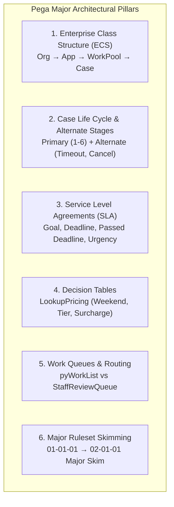

# CineWave Entertainment – Movie Ticket Booking Management
## Comprehensive Pega Platform™ (Major Version Architecture) Implementation & Student Lab Guide

**Application Name:** CineWave Entertainment  
**Platform Version:** Pega Platform™ '24.1 Infinity (Built on Theme-Cosmos:05.01)  
**Application Version:** `01.01.01` (Major: `01`, Minor: `01`, Patch: `01`)  
**Ruleset Version:** `CineWave:01-01-01`  
**Enterprise Class Structure:** `CW-CineWave-Work-MovieBooking`  
**Case Type:** `Movie Ticket Booking` (Case Prefix: `CW-`)  
**Target Audience:** Pega System Architects (CSA / CSSA), Lead System Architects (LSA), Business Architects, and Students  

---

## 1. Project Overview & Pega Major Architecture Pillars

CineWave Entertainment digitizes the movie ticket booking process across multiple theatres, regions, and formats. To build this at enterprise scale, the application incorporates the **Major Pillars of Pega Architecture**:



---

## 2. Enterprise Class Structure (ECS) & Naming Conventions

Pega’s inheritance mechanism uses the Enterprise Class Structure (ECS) to promote reuse and maintainability:

| ECS Layer | Class Name | Description & Inheritance |
|---|---|---|
| **Pega Platform Layer** | `@baseclass`, `Work-`, `Data-` | Out-of-the-box system foundation |
| **Organization Layer** | `CW` | Base organization class for enterprise-wide assets |
| **Application Layer** | `CW-CineWave` | Application-wide reusable assets |
| **Work Pool (Implementation)** | `CW-CineWave-Work` | Base work class for all CineWave case types |
| **Case Type Class** | `CW-CineWave-Work-MovieBooking` | The "Movie Ticket Booking" case type (`is-a Work-Cover-`) |
| **Data Layer** | `CW-CineWave-Data` | Enterprise data layer (`is-a Data-`) |
| **Customer Data** | `CW-CineWave-Data-Customer` | Customer profile attributes and tiers |
| **Movie Data** | `CW-CineWave-Data-Movie` | Movie catalog metadata |
| **Theatre Data** | `CW-CineWave-Data-Theatre` | Hall layouts and geographic locations |
| **Show Data** | `CW-CineWave-Data-Show` | Schedules, timings, base ticket prices |
| **Seat Data** | `CW-CineWave-Data-Seat` | Seat numbers, tiers (Standard, Premium, Recliner), statuses |

---

## 3. Pega Ruleset Major Versioning & Skimming

### 3.1 Ruleset Version Syntax: `NN-NN-NN`
- **Major Version (`01-xx-xx`):** Substantial architectural overhaul, schema alterations, or major release milestones.
- **Minor Version (`xx-01-xx`):** Intermediate feature additions, new sub-processes, or expanded capabilities.
- **Patch Version (`xx-xx-01`):** Bug fixes, minor UI label adjustments, and defect resolutions.

### 3.2 Major Skimming Procedure
When transitioning from version `01` to `02`:
1. Navigate to **Dev Studio > Configure > Application > Structure > Rule management > Ruleset Maintenance**.
2. Select **Skim a RuleSet**.
3. Choose **Major Version Skim** from `01-xx-xx` to `02-01-01`.
4. Pega sweeps all rules in `01`, selects the highest version of each rule, and copies them cleanly into `02-01-01`.
5. Update the Application Definition (`CineWave:02.01.01`).

---

## 4. Data Model & Data Types Setup

Create the following 6 Pega Data Types in **App Studio > Data > Data objects and integrations** or **Dev Studio > Data Types**:

### 4.1 Customer Data Type (`CW-CineWave-Data-Customer`)
| Field Name | Property Name | Type | Key / Required |
|---|---|---|---|
| Customer ID | `.CustomerID` | Text | Key |
| Customer Name | `.CustomerName` | Text | Required |
| Email Address | `.Email` | Email | Required |
| Mobile Number | `.MobileNumber` | Phone | Required |
| Membership Tier | `.CustomerTier` | Picklist (`Regular`, `VIP`, `Gold`) | Required |

### 4.2 Movie Data Type (`CW-CineWave-Data-Movie`)
| Field Name | Property Name | Type | Key / Required |
|---|---|---|---|
| Movie ID | `.MovieID` | Text | Key |
| Movie Title | `.MovieName` | Text | Required |
| Language | `.Language` | Text | Required |
| Genre | `.Genre` | Text | Required |
| Duration | `.Duration` | Text | Optional |
| Rating | `.Rating` | Decimal / Text | Optional |
| Poster URL | `.PosterURL` | URL | Optional |

### 4.3 Theatre Data Type (`CW-CineWave-Data-Theatre`)
| Field Name | Property Name | Type | Key / Required |
|---|---|---|---|
| Theatre ID | `.TheatreID` | Text | Key |
| Theatre Name | `.TheatreName` | Text | Required |
| Location | `.Location` | Text | Required |
| Total Seats | `.TotalSeats` | Integer | Required |

### 4.4 Show Data Type (`CW-CineWave-Data-Show`)
| Field Name | Property Name | Type | Key / Required |
|---|---|---|---|
| Show ID | `.ShowID` | Text | Key |
| Movie Reference | `.Movie` | Single Page (`CW-CineWave-Data-Movie`) | Required |
| Theatre Reference | `.Theatre` | Single Page (`CW-CineWave-Data-Theatre`) | Required |
| Show Date | `.ShowDate` | Date | Required |
| Show Time | `.ShowTime` | TimeOfDay / Text | Required |
| Base Ticket Price | `.TicketPrice` | Currency | Required |
| Available Seats | `.AvailableSeats` | Integer | Calculated |
| Total Seats | `.TotalSeats` | Integer | Required |

### 4.5 Seat Data Type (`CW-CineWave-Data-Seat`)
| Field Name | Property Name | Type | Key / Required |
|---|---|---|---|
| Seat Number | `.SeatNumber` | Text | Key (e.g. A1, B5) |
| Show ID | `.ShowID` | Text | Key |
| Seat Type | `.SeatType` | Picklist (`Standard`, `Premium`, `Recliner`) | Required |
| Seat Status | `.SeatStatus` | Picklist (`Available`, `Booked`, `Reserved`) | Required |

### 4.6 Booking Case Properties (`CW-CineWave-Work-MovieBooking`)
| Field Name | Property Name | Type | Description |
|---|---|---|---|
| Booking ID | `.BookingID` | Text (pyID) | Auto-generated (`CW-10001`) |
| Customer | `.Customer` | Single Page (`CW-CineWave-Data-Customer`) | Customer reference |
| Movie | `.Movie` | Single Page (`CW-CineWave-Data-Movie`) | Selected movie |
| Theatre | `.Theatre` | Single Page (`CW-CineWave-Data-Theatre`) | Selected cinema hall |
| Show | `.Show` | Single Page (`CW-CineWave-Data-Show`) | Selected show |
| Number of Tickets | `.NumberOfTickets` | Integer | Quantity (>= 1) |
| Selected Seats | `.SelectedSeats` | Value List (Text) | e.g. `[A3, A4]` |
| Base Price | `.BasePrice` | Currency | Sourced from Show |
| Effective Ticket Price | `.TicketPrice` | Currency | Evaluated via Decision Table |
| Total Amount | `.TotalAmount` | Currency | Declare Expression |
| Routed To | `.RoutedTo` | Text | `pyWorkList` or `StaffReviewQueue` |
| Case Urgency | `.pxUrgencyWork` | Decimal | SLA Urgency (10 -> 30 -> 60) |
| Ruleset Version | `.RulesetVersion` | Text | e.g. `CineWave:01-01-01` |
| Booking Status | `.pyStatusWork` | Text | Case status |

---

## 5. Case Life Cycle: Primary & Alternate Stages

Pega separates business operations into **Primary Stages** (the happy path) and **Alternate Stages** (exception handling, SLA expirations, cancellations):

```
========================= PRIMARY STAGES =========================
[ Stage 1: Booking Request ]
  └── Process: Capture Customer & Preferences
        ├── Step: Collect Info (View: EnterBookingDetails)
        └── Step: Routing Check (Tickets > 4 &rarr; StaffReviewQueue@CineWave)

[ Stage 2: Check Show & Seat Availability ]
  └── Process: Seat Selection & SLA
        ├── Step: User Action (View: SelectSeatsView)
        ├── SLA: SeatHoldSLA (Goal: 5m [+20 urgency], Deadline: 10m [Route to Alt Stage])
        └── Step: Decision Table (LookupPricing applied to selected tier)

[ Stage 3: Customer Confirmation ]
  └── Process: Review Summary & Pricing Breakdown
        ├── Step: View Summary (View: ReviewBookingSummary)
        └── Step: Decision Shape (Customer Decision)

[ Stage 4: Booking Processing ]
  └── Process: Reserve Seats
        ├── Step: Automation (ReserveSeats Data Transform)
        └── Step: Update Status ("Confirmed")

[ Stage 5: Notification ]
  └── Process: Dispatched Correspondence
        └── Step: Send Email (CorrType: EMAIL, BookingConfirmationNotification)

[ Stage 6: Case Completion ]
  └── Process: Resolution
        └── Step: Update Status ("Completed" / Resolved-Completed)

======================== ALTERNATE STAGES ========================
[ Alternate Stage A: Seat Hold Timeout (SLA Expiry) ]
  └── Triggered When: SLA Deadline (10 mins) elapses without confirmation
  └── Process:
        ├── Step: Release temporary held seats
        ├── Step: Update Urgency to 60
        └── Step: Resolve Case as "Resolved-Timeout"

[ Alternate Stage B: Cancellation ]
  └── Triggered When: Customer clicks Cancel OR Manager Rejects bulk request
  └── Process:
        ├── Step: Release any held seats
        └── Step: Resolve Case as "Cancelled" (Resolved-Cancelled)
```

---

## 6. Service Level Agreements (SLA) & Urgency

Create the SLA rule in **Dev Studio > Process > Service Level Agreement**:
- **Name:** `SeatHoldSLA`
- **Applies To:** `CW-CineWave-Work-MovieBooking`
- **Initial Urgency:** `10`
- **Milestones:**
  - **Goal:**
    - Time: `5 minutes`
    - Urgency Increment: `+20` (Total Urgency: `30`)
    - Action: Log warning in audit trail (`Goal passed - urgency elevated`).
  - **Deadline:**
    - Time: `10 minutes`
    - Urgency Increment: `+30` (Total Urgency: `60`)
    - Action: Execute activity `pzRouteToAlternateStage` (`Seat Hold Timeout`), release seats, update status to `Resolved-Timeout`.

---

## 7. Pega Decision Table: `LookupPricing`

Create the Decision Table in **Dev Studio > Decision > Decision Table**:
- **Name:** `LookupPricing`
- **Applies To:** `CW-CineWave-Work-MovieBooking`
- **Inputs (Conditions):**
  - `.SelectedSeatType` (Standard, Premium, Recliner)
  - `.IsWeekend` (True / False)
  - `.Customer.CustomerTier` (Regular, VIP, Gold)
- **Outputs (Actions):**
  - `SurchargeAmount` (Currency)
  - `DiscountPercentage` (Integer)

### Decision Table Logic Matrix:
| .SelectedSeatType | .IsWeekend | .Customer.CustomerTier | SurchargeAmount | DiscountPercentage |
|---|---|---|---|---|
| `"Standard"` | `false` | `"Regular"` | `0` | `0%` |
| `"Standard"` | `true` | `"Regular"` | `30` | `0%` |
| `"Standard"` | `_` | `"VIP"` | `0` (or weekend +30) | `15%` |
| `"Standard"` | `_` | `"Gold"` | `0` (or weekend +30) | `25%` |
| `"Premium"` | `_` | `"Regular"` | `50` | `0%` |
| `"Premium"` | `_` | `"VIP"` | `50` | `15%` |
| `"Recliner"` | `_` | `_` | `150` | `_` |

---

## 8. Pega Routing & Work Queues

Pega provides two primary routing mechanisms:
1. **`pyWorkList` (Personal Worklist):** Assignments routed directly to a named operator (e.g. the customer).
2. **`ToWorkQueue` (Work Queue):** Shared pool of work accessible to operators with the appropriate skills or role.

### Bulk Booking Routing Business Rule:
- **Condition:** `If .NumberOfTickets > 4`
- **Router:** `ToWorkQueue("StaffReviewQueue@CineWave")`
- **Status:** `Pending-ManagerApproval`
- **Access Role Required:** `CineWave:Manager` (Privilege: `CanApproveBulkBookings`)
- When approved, case is routed back to `pyWorkList` for seat selection.

---

## 9. Role-Based Access Control (RBAC)

In Pega, security is defined by **Access Groups**, **Access Roles**, and **Privileges**:

| Access Group | Portal | Roles | Privileges |
|---|---|---|---|
| `CineWave:CustomerUser` | `CustomerPortal` | `CineWave:User` | Create booking, confirm/cancel own booking |
| `CineWave:StaffOperator` | `StaffPortal` | `CineWave:Operator` | View ledger, inspect seat layouts, cancel booking |
| `CineWave:CinemaManager` | `StaffPortal` | `CineWave:Manager` | Approve bulk bookings, perform Major Ruleset Skim |

---

## 10. Comprehensive Verification & Lab Scenarios

### Scenario 1: Primary Lifecycle Happy Path under Ruleset Major 01
1. Customer initiates booking for 2 tickets with `VIP` membership.
2. System evaluates `LookupPricing` Decision Table (applies 15% VIP discount).
3. Customer selects seats `A3, A4`.
4. Confirmation received before SLA Goal/Deadline.
5. System confirms reservation, dispatches email correspondence, marks case `Completed` under `CineWave:01-01-01`.

### Scenario 2: Work Queue Routing for Bulk Orders
1. Customer requests `5 tickets` (> 4 bulk threshold).
2. Pega router automatically sets status to `Pending-ManagerApproval` and routes case to `StaffReviewQueue@CineWave`.
3. Cinema Manager reviews case in the Staff Portal and clicks **Approve**.
4. Case routes back to customer worklist to proceed with seat selection.

### Scenario 3: SLA Deadline Expiration & Alternate Stage
1. Customer initiates booking and selects seat `B3`.
2. Customer is idle past the 10-minute SLA deadline (simulated via **Fast-Forward SLA** button).
3. Pega SLA engine elevates urgency to `60`, releases seat `B3`, and routes case to **Alternate Stage: Seat Hold Timeout** with status `Resolved-Timeout`.

### Scenario 4: Customer Cancellation to Alternate Stage
1. Customer selects seats and reviews summary in Stage 3.
2. Customer clicks **Cancel Booking**.
3. Case routes to **Alternate Stage: Cancellation**, releases reserved seats, and updates status to `Cancelled`.

### Scenario 5: Pega Major Ruleset Skim (`01-01-01` &rarr; `02-01-01`)
1. In Staff Portal > **Pega Major Ruleset Skim**, Manager clicks **Perform Pega Major Ruleset Skim**.
2. Ruleset version elevates to `CineWave:02-01-01` (Major `02`).
3. Subsequent new cases inherit the new major version `CineWave:02-01-01`.
